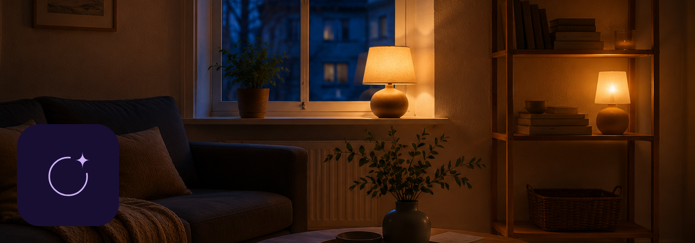

# Lightkeeper



[](https://github.com/thomassidor/lightkeeper/actions/workflows/ci.yml)
[](LICENSE)

**Use any remote to control any lights, and put any lights on a timer — without writing a single
Flow.**

A Homey Pro app.

---

## The problem

I recently bought three scroll wheel remotes from IKEA. Three remotes, three lights each, three things I
wanted each remote to do — 27 Flows to build by hand. Half an hour of clicking, maybe an hour. I
couldn't be bothered, so I spent a couple of days building this instead. Or rather, I had AI build
it.

The general version: you have a remote — an IKEA STYRBAR, a Hue Dimmer, a rotary dial — and you have
lights. Making one control the other on Homey means opening the Flow editor and building a Flow for
every button, for every light, for every thing you want that button to do. Turn on. Turn off.
Brighter. Dimmer. Then again for the next lamp.

It works, and it is tedious.

Schedules are the same story told with a clock. Lights on when it gets dark, off at bedtime,
weekdays only — that is two Flows per window, one of them at a time you worked out by hand, and
every change means finding both again.

## What Lightkeeper does

Two kinds of device, both built the same way.

**A controller.** Pick a remote. Pick the lights. Say which button does what. Save.

**A schedule.** Pick the lights. Say when they come on, and whether they go off after a while or at
a set time. Add as many windows as you need. Save.

Lightkeeper writes the Flows for you, keeps them in a folder of their own, and maintains them as
things change. If you add a lamp to a room a device points at, it follows. If you delete the device,
its Flows go with it — and only its Flows.

You never open the Flow editor.

## Built with AI

This app was designed and written end to end with [Claude](https://claude.com/claude-code) —
architecture, implementation, tests and documentation. A human directed the work, made the product
decisions, and verified the result on real hardware.

That is stated plainly here because you deserve to know what you are installing and what you are
reading. If it changes how carefully you want to review the code before trusting it with your
home: fair, and the code is right here.

---

## Requirements

- **Homey Pro 2023 or later.** Homey Pro 2019 and earlier cannot create API Keys, which this app
  needs — see below.
- **Firmware 12.9.0 or newer.**
- **Homey Cloud is not supported.** The design depends on broad local Web API access.

## Setup

### 1. Give Lightkeeper an API key

**Homey does not let an app create Flows on its own.** An app's own token is refused with
`403 Missing Scopes` on every flow write. A Personal API Key that you create succeeds. Since
generating Flows is the entire mechanism by which this app works, and no app permission grants it,
Lightkeeper asks you for a key.

1. Open [my.homey.app](https://my.homey.app) and pick your Homey
2. Settings → API Keys → New API Key
3. Tick the **Flow** permissions, then create it
4. Copy the key — it is shown only once — and paste it into Lightkeeper

The key is stored on your Homey and never leaves it. It is never logged, never returned by the
app's own API, and never included in the diagnostics export. It is used for **flow writes only**.

If the key later stops working, your controllers keep driving your lights and your existing
schedules keep firing. Only Flow maintenance pauses, and you are asked for a new key without losing
a single mapping.

### 2. Add a controller

Devices → Add → Lightkeeper → Controller. Then:

- **Choose a remote** — grouped by room, with a count of the events Homey exposes for each
- **Choose lights** — individually, or a whole zone
- **Map the controls** — assign a lighting function to each button, hold or turn. Every row has a
  **Test** button that drives the real lights immediately, before you save anything

Homey lets you rename the device afterwards, so there is no name field to fill in.

### 3. Add a schedule

Devices → Add → Lightkeeper → Light schedule. Then:

- **Choose lights** — the same picker, individually or a whole zone
- **Set the times** — for each schedule: an on-time, the days it runs, and either a duration or an
  off-time. Optionally a brightness and a warmth, offered only if the lights you chose support them
- **Test on** and **Test off** drive the real lights immediately, before you save anything

Up to twelve schedules on one device. The device's own switch pauses the whole thing without losing
anything — useful when you are away, or when you would rather it left the room alone tonight.

---

## How it works

### Two API clients, deliberately separated

| Client | Authenticated as | Responsible for |
|---|---|---|
| App API | the app's own token | reading devices and zones, subscribing to capability changes, writing to your lights |
| Local API | your Personal API Key | creating, updating and deleting Flows |

The separation bounds the damage when a key expires: only Flow maintenance stops. Your remotes
keep working.

### What it writes

Ordinary Flows, in a folder called **Lightkeeper**, each with one internal Lightkeeper action card:

- **A controller** gets one Flow per mapped event, triggered by your remote's own trigger card, and
  only for events you actually mapped.
- **A schedule** gets two Flows per window — one at each end — triggered by Homey's own time
  trigger. The days it runs are deliberately not in the Flow: it fires every day and the app checks
  the day against your Homey's clock, so changing weekdays to weekends rewrites nothing.

Idempotent either way, so reconfiguring reuses Flows rather than duplicating them. Move a schedule
from 22:00 to 23:00 and the old pair is replaced, rather than left behind firing at the old time.

### Safety properties

- **A ramp stops after 10 seconds, always.** Not configurable. Release events are routinely
  dropped on Zigbee and unreliable on Matter/Thread, so a stuck ramp is a certainty, not a risk —
  and a light ramping forever is the worst thing this app could do to you.
- **A Flow you have edited by hand is never overwritten.** The device marks itself for repair
  instead — including a schedule whose time you changed in the Flow editor rather than in the app.
- **Deleting a device deletes only the Flows it demonstrably created.**
- **The orphan cleanup refuses to run when nothing is loaded**, because every Flow would
  look orphaned in that state.
- **A schedule never switches your lights off retroactively.** If the app was down when a window
  should have ended, the lights are left alone — see the limits below. Coming back up *inside* a
  window does switch them on, because that is the case where doing nothing means a dark evening.
- **Pausing a schedule keeps its Flows.** Pausing means "do not act", not "throw the setup away", so
  resuming is instant and any folder you moved those Flows into survives.
- **Nothing leaves your Homey.** No telemetry, opt-in or otherwise. The diagnostics export is
  generated locally and shared only if you choose to attach it to a report.

### Diagnostics

Homey settings → Lightkeeper shows the last remote presses received, whether each was handled or
ignored and why, and every write actually attempted against a light. That distinction — a Flow
that never fired, versus one that fired and was refused, versus an intent that never reached the
queue — is what makes a silent failure diagnosable at all.

---

## Limits, stated plainly

**"Any remote" means any remote for which Homey exposes something usable** — either a capability
change, or a flow trigger card bindable to that device. If the owning integration exposes neither,
the input is unobservable through public Homey interfaces and no app can reach it.

The same hardware can expose a different event surface through different pairing paths: a Hue
device offers more through the Philips Hue app than through Matter. So support is not a property
of the model on the box.

Controls whose range would expand past 12 Flow variants are declined rather than filling your Flow
list.

**Schedules follow your Homey's own clock**, daylight-saving changes included, because Homey's time
trigger is what fires them. The settings page shows which timezone that is, next to each schedule's
windows.

**Twelve schedules per device**, which is twenty-four generated Flows. Add a second schedule device
if you need more; the cap exists so your Flow list stays readable.

**If the app is not running at the moment a window should end, that off is missed** and the lights
stay on until the next one.

**Times are clock times.** Sunrise and sunset are not offered yet.

---

## When something is wrong

**A press does nothing.** This is the one worth knowing how to read, because three
different failures look identical from the sofa. Open Homey settings → Lightkeeper and
look at **Recent remote presses**:

- **No row at all** — the generated Flow never fired. The remote's event did not reach
  Lightkeeper, so the problem is upstream of this app.
- **A row marked ignored** — the event arrived and was deliberately not acted on. The
  row says why.
- **A row marked handled** — Lightkeeper acted. Now look at **Writes to lights**: a
  write that was sent and refused is a target problem; no write at all means the
  intent never reached the queue.

That distinction is the whole reason those two lists exist.

**No usable events found for my remote.** The owning integration exposes neither a
capability change nor a bindable trigger card for this pairing path. Try another
official pairing path if the device has one — a Hue remote exposes more through the
Philips Hue app than through Matter. If there is no such path, the device cannot be
observed through Homey's public interfaces and no app can reach it.

**The key does not work.** Create a complete new Personal API Key *with Flow
permissions*. A key without them validates ordinary reads but cannot maintain Flows,
and the two failures are reported differently — the message tells you which one you
have.

**A light is unavailable.** Bring it and its integration back online. Zone targets
resolve at the moment of use, so a light that comes back is included again without
any reconfiguration.

**Brightness keeps changing on its own.** Every ramp stops unconditionally after 10
seconds, because release events do get lost. If your remote exposes no release event,
Lightkeeper offers stepping rather than a hold ramp in the first place.

**A schedule did not fire.** Look at the schedule's card in Homey settings → Lightkeeper.
It lists every window, whether one is on right now, and the clock those times are read
against — a Homey in an unexpected timezone is the most common answer by far. If the card
says paused, the device's switch is off. Otherwise check **Recent remote presses**: a
schedule's boundary arrives there like any other event, with the reason when it was
ignored, including "not one of this schedule's days".

### Repair, and what it fixes

Open repair on the controller (Devices → the controller → Repair):

| Situation | What repair does |
|---|---|
| API key expired or revoked | Save a new key. Lights keep working throughout; Flow maintenance resumes once it validates. Nothing you configured is lost. |
| The remote was re-added under a new id | Select the matching remote. One tap keeps every mapping and target. |
| The remote now exposes different events | Remap the affected controls. |
| A generated Flow was edited by hand | Rebuilds it. Lightkeeper never silently overwrites your edit — it asks. |
| A schedule needs different lights or different times | Reopens both of its screens with everything as you left it. |

### Removing it

Deleting a controller or a schedule removes only the Flows it can attribute to that device. The
settings page can also find orphaned Lightkeeper Flows, and refuses to clean up when no
controller is running — in that state every managed Flow looks orphaned and attribution
would be unsafe. Uninstalling the app removes its settings, including the stored key.

---

## Tested on

Verified end to end on a Homey Pro 2023 (firmware 13.4.0) with four remotes across three
transports:

| Remote | Transport | Notable for |
|---|---|---|
| IKEA STYRBAR E2001/E2002 | Zigbee, local | press and long-press on the same control |
| Philips Hue Dimmer v2 | Hue Bridge | four buttons, no hold available at all |
| Philips Hue Tap Dial | Hue Bridge | rotation with a magnitude token |
| IKEA BILRESA | Matter/Thread | scroll wheel, and cards that vanish on restart |

Schedules were verified on the same Homey: a window switched three Hue spots on at its start minute,
applied the brightness and warmth it was given, and switched them off again at its end minute, both
boundaries firing within ~20 ms of the clock. Their day handling and midnight-crossing arithmetic is
covered by unit tests rather than by a week of waiting. The trigger card they are built on is
resolved at runtime by enumerating what your Homey actually offers, rather than hardcoding an id, so
it adapts if a firmware update moves it.

309 unit tests, type-clean, validated at `publish` level.

---

## Development

```bash
npm install
npm test                          # 309 unit tests, no hardware needed
npm run typecheck
npx homey app install             # persistent install — use this for anything interactive
npx homey app validate --level publish
```

**Use `homey app install` for interactive testing, not `homey app run`.** `run` creates a debug
session and **uninstalls the app when the CLI exits**, taking its app settings with it — including
the stored API key. Pairing against a session that has ended gives screens that render but do
nothing, because the handlers are gone.

**`--remote` is not optional on `run`.** Since CLI 3.x a bare `homey app run` runs the app in a
local Docker container; `--remote` runs it on the Homey, which is the only faithful context for
anything touching app-scoped permissions.

**Do not share an API key between the app and an external script.** A key embeds a session id, and
concurrent holders appear to invalidate one another.

**A release writes the changelog twice.** `.homeychangelog.json` is what Homey shows in the store;
[Changelog](#changelog) below is the same release for anyone reading the repo. Both go in the commit
that bumps the version, and `test/unit/release-metadata.test.ts` fails if either is missing it. Full
checklist in [CLAUDE.md](CLAUDE.md#releasing-a-version).

### Layout

```
app.ts                          app entry, bridge action listeners, validation on receipt
api.ts                          app Web API consumed by the settings page
lib/
  homey-api-service.ts          both API clients, subscription teardown
  credential-service.ts         the API key: storage, validation, failure classification
  device-catalog.ts             devices, zones, owning apps, capability metadata
  source-discovery-service.ts   trigger card discovery and event-surface fingerprints
  inputs/                       input contract, normalizer, magnitude collapse
  mapping/                      mapping engine, supersede gate, types
  outputs/                      intents, perceptual curve, planner, scheduler, ramp engine
  bridge/                       binding compiler, flow bridge manager, reconciler
  runtime/                      controller runtime, manager, health monitor, target health
  profiles/                     profile schema, repository, migrations
  schedules/                    schedule types, window maths, local clock, runtime, manager
  pairing/                      the light picker, shared by both drivers
drivers/controller/             virtual device, driver, four pairing views
drivers/schedule/               virtual device, driver, three pairing views
scripts/sync-views.mjs          copies pair views into repair/, and shared views between drivers
test/                           unit tests and fixtures transcribed from real hardware
docs/                           review notes, privacy, localisation, artwork (not bundled)
```

**Read [`CLAUDE.md`](CLAUDE.md) before changing anything.** It carries the architectural rules and a
Homey platform reference — how flow card URIs are really shaped, how device trigger cards are
actually discovered, how tokens are encoded, why API keys expire — established against real
hardware and documented nowhere else.

### Testing philosophy

Fixtures in `test/fixtures/reference-devices.ts` are transcribed verbatim from four real remotes.
The raw capture data is kept separate from the expected normalised catalogue, so the tests prove
the normalizer rather than the fixture — a fixture that also encoded the expectation would pass
against a normalizer that did nothing.

Captures from a real home are never committed; see [`test/fixtures/README.md`](test/fixtures/README.md).

### Reference

- [`docs/privacy.md`](docs/privacy.md) — what the app reads, stores and never transmits
- [`docs/homey-review-notes.md`](docs/homey-review-notes.md) — why `homey:manager:api` and a
  Personal API Key are both unavoidable, plus what is still untested
- [`docs/localisation.md`](docs/localisation.md) — the app is English-only; how to add a language
- [`docs/asset-spec.md`](docs/asset-spec.md) — every graphic the app ships, its size and its purpose
- [`docs/artwork/provenance.md`](docs/artwork/provenance.md) — where the artwork came from, the palette's source, and the rights register

---

## Changelog

### 0.3.0

Changed:

- **New artwork throughout, and a new palette to go with it.** The app's mark is the logo — an open
  circle with a sparkle — and the two device icons are a remote and a stopwatch drawn in the same
  hand. The brand colour is now the logo's own violet `#180E32`, with its lavender `#CCB0F3` as the
  accent, and every screen the app draws follows: the settings page and all seven pairing views take
  the violet in light mode and the lavender in dark. Both hexes are read out of the logo bitmap by
  `docs/artwork/export-assets.py --palette`, and a test fails if the manifest ever disagrees with it.
- **The store image and both device pictures are new photographs.** An evening room with two lamps
  lit for the app, a remote for the controller, and — at last — a real device for the schedule: a
  plug-in timer with a glowing dial, instead of a lamp standing in for hardware it does not have.
- **The icons are generated now, not hand-drawn twice.** `export-assets.py` builds all three from the
  SVG masters in `docs/artwork/masters/`: it centres each drawing on Homey's 960 canvas, normalises
  the paint so the mask reads, and stamps the file with the master it came from. The device pictures
  are cropped by finding the object against its white ground, so replacing a master reframes the crop
  instead of silently mis-centring it. No hand-measured crop boxes remain.
- **The README has a banner** — the hero photograph with the logo on a rounded violet tile, built by
  the same script.

### 0.2.2

Changed:

- **All three icons are line art now.** A lighthouse for the app — the old mark drew a remote
  beaming at a bulb, which was the previous name made literal — plus the remote and the clock
  redrawn to match. This is not a taste change: `homey-lib` renders icons **white** on the brand
  colour in several surfaces (its own words: *"Icons are rendered white, so choose a darker color
  that has enough contrast"*), where a filled two-colour mark collapses into one silhouette. Athom's
  guideline 1.5 forbids filled illustrations outright, and every one of the 226 stock class icons
  Homey ships is stroke-only at `stroke-width: 40`. Ours now are too.
- **The store image drops the hand and the remote.** Same photograph, new window on it: two lamps
  lit and a blue-hour window, so it reads as lights that came on by themselves rather than as a
  remote being pressed. The old crop predated schedules and described half the app.
- **The schedule device shows a lamp instead of its own icon.** Rasterising the icon onto white was
  the app's most likely review finding — guideline 1.4 rejects *"images with big two-dimensional
  unicolored shapes on a monochrome or transparent background"* and 1.4.3 asks for *"a recognizable
  picture of the device it supports"*. A schedule has no hardware, so the device is the lamp.
- **`test/unit/assets.test.ts`** now checks every shipped image for presence, real PNG bytes and
  exact dimensions, and every icon for the line-art invariants — the class of mistake that is
  otherwise invisible until submission, and the artwork docs gained the distinction between what the
  validator enforces and what a reviewer applies, with citations.

Worth knowing if you install this over the CLI rather than from the store: **the app will show no
icon at all.** Homey renders an icon as a CSS mask fetched from `icons-cdn.athom.com` by the file's
MD5, and that CDN only holds icons from published builds — so a development install leaves an empty
brand-colour circle where the icon belongs. Nothing is wrong; it appears once the app is published.
The mechanism is written up in [CLAUDE.md](CLAUDE.md) §10.

### 0.2.1

Fixed:

- **Colour temperature ran backwards.** `light_temperature` is normalised 0–1 and **higher is
  warmer** — that is `homey-lib`'s own capability hint, and both the controller's `warmer`/`colder`
  mapping and the schedule screen's warmth labels assumed the opposite. A schedule set to "Warmest"
  wrote 0 and lit a room cold white on the first live run; a remote's "warmer" button made lights
  colder. Both directions are now fixed, the axis is documented in
  [CLAUDE.md](CLAUDE.md) §6 with the evidence, and a test pins the two code paths that produce
  temperature intents against each other, since them disagreeing is the shape this bug took.
  A schedule saved before this update keeps the number it was given, so its warmth may now read
  differently on screen — open it and check it says what you meant.

### 0.2.0

Added:

- **Light schedules, as a second kind of device.** Pick lights, then set one or more windows: an
  on-time, the days it runs, and either a duration or an off-time — plus an optional brightness and
  warmth. Two generated Flows per window, triggered by Homey's own time trigger, reconciled through
  the same machinery the remote controllers use. The day filter deliberately lives in the app rather
  than in the Flow, so changing which days a schedule runs on rewrites nothing.
- **A pause switch on each schedule device.** Pausing stops it acting and keeps its Flows, so
  resuming is instant. Resuming inside a window that has already started switches the lights on
  rather than waiting for tomorrow — the same catch-up that runs after an app restart.
- **A new name.** "Light Link" described pointing one thing at another, which is now half of what
  the app does. Nothing is carried over from the old name because nothing had shipped under it.

Changed:

- **Hand-edited Flows are detected in more cases.** The check now compares the trigger's arguments as
  well as its card and our own action, so a schedule whose time you changed in the Flow editor is
  respected instead of being silently ignored — the device asks to be repaired.
- **The orphan cleanup counts both kinds of device as live.** Without that, the first cleanup after
  this release would have found every schedule's Flows unattributable and deleted them.

### 0.1.1

Fixed:

- **Repair now opens.** It failed with an internal file error before any screen appeared, so a
  controller that needed repair had no way to be fixed. Homey serves repair views from their own
  folder, and `homey app validate` does not check that they exist.
- **A reassigned button says so where you are looking.** Giving a button a job another button
  already had now shows a note next to both controls. The notice used to sit at the bottom of the
  screen, below every light — where nobody saw it, while the control that lost its job quietly went
  back to "Not assigned".
- **App settings show the API key status in colour.** Green when a working key is saved, amber when
  none is saved yet, red when a saved key has stopped working. Previously every message on that page
  rendered the same flat grey, success and failure alike.

Added:

- **A changelog, and a release process that is enforced rather than remembered.** This section and
  `.homeychangelog.json` now record each release, and a test fails if the version, either changelog,
  or the test count this README quotes fall out of step.

### 0.1.0

First release. Paired remotes, switches, buttons and rotary dials driving on/off, brightness and
colour temperature across individual lights or zones, with the Flows underneath created and
maintained automatically. Local connection, Homey Pro 2023 and later.

---

## Contributing

See [CONTRIBUTING.md](CONTRIBUTING.md). Bug reports are best accompanied by the diagnostics export
from Homey settings → Lightkeeper → **Copy for a bug report**, which deliberately contains no key
material.

## Licence

[MIT](LICENSE) © Thomas René Sidor
