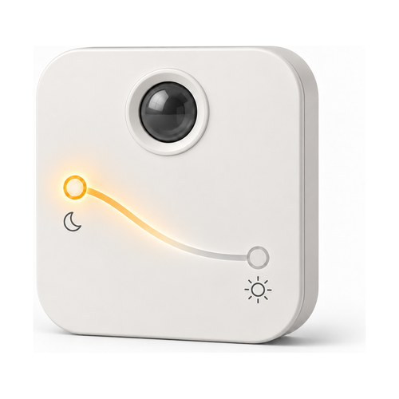

# Lightkeeper

**Use any remote to control any lights, put any lights on a timer, let them follow the colour of the
day, and let them dim themselves as the daylight comes up — without writing a single Flow.**

A Homey Pro app. A **Flow** is Homey's automation rule — *when this happens, do that* — and it is
how you normally make a remote drive a lamp. One Flow per button, times every lamp, times every
thing you want that button to do. It works, and it is tedious. Lightkeeper asks you a few questions
instead, then writes those Flows for you and keeps them correct as your home changes. Built end to
end with AI, directed and verified on real hardware by a human — [the full story is
below](#built-with-ai).

## Contents

- [What it does](#what-it-does)
- [Requirements](#requirements)
- [Getting started](#getting-started)
- [What you can rely on](#what-you-can-rely-on)
- [Good to know](#good-to-know)
- [When something is wrong](#when-something-is-wrong)
- [Privacy](#privacy)
- [Changelog](#changelog)
- [Built with AI](#built-with-ai)
- [Contributing](#contributing)
- [Licence](#licence)

---

## What it does

Five kinds of device, doing four jobs: **driving lights from a remote**, **putting lights on a
timer**, **moving lights through the colours of the day** — that one in a simple version and a
detailed version — and **setting their brightness from how much light is in the room already**. You
add them the way you add any Homey device: **Devices → Add → Lightkeeper**.

<table>
<tr>
<td width="160"></td>
<td>

### Light Remote

Turns a remote, switch or dial you have **already paired** with Homey into a controller for lights
you choose. Pick the remote, pick the lights, say what each press, hold or turn should do — on, off,
brighter, dimmer, warmer, cooler.

*Needs a Personal API Key: a token you generate on your own Homey, which is what lets Lightkeeper
write Flows on your behalf. [Step 2 below](#2-give-it-an-api-key--if-you-need-one) walks through
making one.*

</td>
</tr>
<tr>
<td width="160"></td>
<td>

### Light schedule

Puts lights on a timer. You fill in **windows** — one window is one period: the lights come on at a
time you set, and go off again either after a number of minutes or at a second time you set, on the
weekdays you tick. You can also fix the brightness and warmth they come on at, or leave those as
they were. Up to twelve windows in one device, and a switch on the device's tile in Homey that
pauses all of them at once.

*Needs a Personal API Key as well, for the same reason: it writes Flows.*

</td>
</tr>
<tr>
<td width="160"></td>
<td>

### Circadian light

Moves your lights through the colours of the day by itself. You describe three parts of the day —
**morning**, **midday** and **evening** — and how warm the light should be in each, and Lightkeeper
fades between them. Morning ends a little after sunrise and evening begins a little before sunset,
both worked out from your Homey's own location, so the day follows the real one through the year
instead of a fixed clock. You can move either boundary in quarter-hour steps.

Brightness is optional: leave it off and only the colour changes.

*No API key, because it writes no Flows. It adjusts lights that are already on, and never switches
one on or off itself.*

</td>
</tr>
<tr>
<td width="160"></td>
<td>

### Colour Curve Light

The detailed version of the circadian light above. Same job — colour through the day — but rather
than describing three parts of the day and letting Lightkeeper shape it, you draw the day yourself,
as two to eight **points**. A point is one moment: a time of day, how warm the light is then, and
optionally a brightness. At any point you may pick **a colour instead of a warmth**, from a palette
of twenty-four. Between two points the lights fade gradually from one to the next.

Every point keeps a warmth even when you give it a colour, and a lamp that cannot show colours uses
that warmth — so plain white lamps and colour lamps move through the same day together.

*No API key, and the same rule: it never switches a light on or off.* Choose a Colour Curve Light
when you want a particular look at a particular hour; choose a circadian light when "warm at night,
cool in the day" is all you are after.

</td>
</tr>
<tr>
<td width="160"></td>
<td>

### Room-sensing Light

Sets your lights' brightness from how much light is in the room **already** — dimming them as the
morning comes up and lifting them again as it goes, or the other way round if you would rather the
room followed the day. You set two things: how bright the lights should be when the room is dark,
and when it is bright. Which of those two is higher is entirely up to you.

It works out how light it is from **a light sensor you already own** — most motion sensors have
one — or, if you would rather, from **how high the sun is**, which it works out from your Homey's
own location and needs nothing from you. While you are choosing, it draws that sensor's own last
week as a grid, so "dark" and "bright" are numbers you can judge against what the room actually
does rather than guess at.

*No API key, and the same rule again: it only dims lights that are already on, and never switches
one on or off.*

</td>
</tr>
</table>

All five have a **Test** button while you are setting them up, which drives your actual lights then
and there, so you know it works before you save anything.

The **Light Remote** and the **light schedule** do their work by writing Homey Flows behind the
scenes, and Lightkeeper looks after those Flows for you. You can point either one at a whole room
instead of at named lamps, and a lamp you add to that room later is picked up on its own. Delete the
device and its Flows are deleted with it — its own, and nothing else. **You never open the Flow
editor.** The **circadian light** and the **Colour Curve Light** write no Flows at all: they watch
your lights and adjust them directly, which is why neither needs a key.

---

## Requirements

- **Homey Pro 2023 or later.** Homey Pro 2019 and earlier cannot create API Keys at all, and
  Lightkeeper needs one to write Flows.
- **Firmware 12.9.0 or newer.**
- **Homey Cloud is not supported.** Lightkeeper needs wide access to the local API on the Homey
  itself, which only Homey Pro offers.
- **A Personal API Key**, but only if you are adding a Light Remote or a light schedule.
  Circadian lights, Colour Curve Lights and Room-sensing Lights need none.
  [Why?](FAQ.md#why-does-it-need-a-personal-api-key)
- **Your Homey's location**, for a circadian light, and for a Room-sensing Light set to follow the
  sun. Homey asks for it during setup, so you almost certainly have one already; the app reads it to
  work out sunrise, sunset and how high the sun is, and it never leaves the Homey. Without one, a
  circadian light falls back to 06:00 and 21:00 and says so while you are setting it up.

## Getting started

### 1. Install it

From the Homey App Store. Or, if you have cloned this repository, `npx homey app install`.

### 2. Give it an API key — if you need one

Only if you are adding a **Light Remote** or a **light schedule**, and Lightkeeper asks for it near
the start of setup rather than at the end, so nothing you have filled in can be lost to it. Skip it
entirely for a circadian light, a Colour Curve Light or a Room-sensing Light. It is one key per
Homey, so the second Light Remote you add never asks again.

1. Open [my.homey.app](https://my.homey.app) and pick your Homey
2. Settings → API Keys → New API Key
3. Tick the **Flow** permissions, then create it
4. Copy the key — it is shown only once — and paste it into Lightkeeper when it asks

The key is stored on your Homey and never leaves it. It is never written to a log, never handed
back out by the app, and never included in a diagnostics export. Lightkeeper uses it for one thing
only: **writing Flows**.

A key can stop working — Homey invalidates the session behind it from time to time, even though the
key you pasted is unchanged. If that happens, everything already set up carries on: your Light
Remotes keep driving your lights and your schedules keep firing, because those Flows are already
written.
What stops is Lightkeeper's ability to write new Flows or repair existing ones. It asks you for a
fresh key, and nothing you have configured is lost.

### 3. Add your first device

**Devices → Add → Lightkeeper**, then pick a type. Each one is a short sequence of screens:

Each one opens with a short screen saying what the device does and what it is about to ask, then a
numbered step per question, then a review of everything before anything is saved. Every row on that
review jumps back to the step it came from.

| Device | The steps |
|---|---|
| Light Remote | API key → **1** choose a remote (listed by room, or press a button and let Lightkeeper find it) → **2** choose lights → **3** one row per button, each saying what it does → **4** review |
| Light schedule | API key → **1** choose lights → **2** draw the blocks on a day → **3** review |
| Circadian light | **1** choose lights → **2** morning, midday and evening → **3** review |
| Colour Curve Light | **1** choose lights → **2** build the curve point by point → **3** review |
| Room-sensing Light | **1** choose lights → **2** choose a sensor, or the sun → **3** dark and bright → **4** review |

Homey lets you rename a device afterwards, so there is no name field to fill in.

---

## What you can rely on

These are promises, not implementation details — each one is covered by a named test in
[`test/unit/safety-promises.test.ts`](test/unit/safety-promises.test.ts).

- **A ramp stops after 10 seconds, always.** A ramp is what happens while you hold a button down:
  the light keeps getting brighter, or dimmer, until you let go. The trouble is that the "let go"
  message is routinely lost on Zigbee and unreliable on Matter and Thread — so a light that ramps
  until told to stop will eventually never be told, and a lamp stuck ramping is the worst thing this
  app could do to you. Every ramp therefore ends by itself after ten seconds. Not configurable.
- **A Flow you have edited yourself is never overwritten.** If Lightkeeper finds that one of the
  Flows it wrote has been changed by hand, it stops touching it and flags the device as needing
  repair in Homey, so the decision to discard your edit is always yours.
- **Deleting a device deletes only the Flows it demonstrably created.** Attribution is the device's
  own id, carried inside the Flow.
- **A Flow you have moved yourself stays where you put it.** Lightkeeper files the Flows it writes
  into a folder per device, but it will only ever move a Flow that is still sitting in Lightkeeper's
  own folder. Drag one into a folder of your own and it is left alone from then on.
- **Lightkeeper never overrides something you have just done.** Dim or recolour a lamp by hand and
  the Lightkeeper device driving that lamp leaves it alone — just that lamp, not the rest. It takes
  over again the next time the lamp is switched off and on, or after four hours, whichever is first.
- **Nothing leaves your Homey.** No telemetry, opt-in or otherwise.

## Good to know

The five limits most likely to matter. [FAQ.md](FAQ.md#limits) has the rest, stated just as plainly.

- **"Any remote" means any remote your Homey already reports button presses from.** Lightkeeper can
  only work with what the remote's own Homey app publishes — either a change it announces (a button
  state, a dial position) or a Flow trigger card it offers. A few integrations publish neither, and
  then no app on your Homey can react to that remote, Lightkeeper included.
- **Times are clock times** — an hour and a minute you type in. Sunrise and sunset are not available
  yet, neither in schedules nor in circadian and Colour Curve Lights.
- **If the app was not running at the moment a window should have ended, that "off" is missed**, and
  those lights stay on until the next window switches them. Lightkeeper deliberately does not go
  back and catch up on a missed "off": having your lights go dark on you some time after a restart
  is the worse surprise.
- **Two Lightkeeper devices pointed at the same lamp will fight over it** — a schedule sets
  brightness and warmth as it switches lights on, while a circadian or Colour Curve Light keeps
  changing them all day. Give any one lamp to one Lightkeeper device.
- **A circadian light and a Colour Curve Light check in every few minutes**, and write to a lamp
  only once the colour has moved far enough to be visible. Neither does anything while the app is
  not running.

## When something is wrong

Homey settings → Lightkeeper lists the remote presses it received most recently, whether each one
was acted on or ignored **and why**, and every change it actually tried to make to a light. When a
button appears to do nothing, that page separates the three reasons it could be: the Flow never
fired at all, or it fired and the lamp refused the change, or Lightkeeper worked out what to do and
the instruction never got sent. Knowing which of the three you have is what makes a silent failure
diagnosable at all.

**[FAQ.md → When something is wrong](FAQ.md#when-something-is-wrong)** walks through the symptoms
one at a time: a press that does nothing, a remote whose buttons Lightkeeper cannot offer you, a key
that will not validate, a schedule that did not fire, and what Homey's **Repair** does when you run
it on a Lightkeeper device.

## Privacy

Nothing leaves your Homey — no telemetry, no cloud, no analytics. The diagnostics export is
generated locally and shared only if you choose to attach it to a bug report, and it deliberately
contains no key material. [`docs/privacy.md`](docs/privacy.md) is the full notice: what the app
reads, what it stores, and for how long.

---

## Changelog

**0.6.0** — the current release. A fifth device type, and then everything that followed it:

- **Room-sensing Lights**, which set brightness from how much light is already in the room, and draw
  your sensor's own last week so "dark" and "bright" are numbers you can judge.
- **Every setup screen redrawn.** One question per screen, a numbered path through each device, and
  a review of everything before it saves.
- **Circadian lights follow the real sun**: three parts of the day, with morning and evening
  anchored to your Homey's own sunrise and sunset instead of a fixed clock.
- The five defects that a recorded week in a real home found — chief among them a light that
  quietly reverts to its own settings no longer muting its device for days.
- **Three device types renamed**: Light controller → **Light Remote**, Curve light → **Colour
  Curve Light**, Daylight light → **Room-sensing Light**. Names only; devices you already added
  are untouched.

The recorder that produced that week is a development tool and is not part of the app you install.

Earlier releases, one line each:

| Version | What changed |
|---|---|
| **0.5.2** | Four fixes to the colour-following lights, and the dimmest brightness no longer meant off |
| **0.5.1** | A shorter App Store listing, prose release notes, and icons legible at 24 px |
| **0.5.0** | A Colour Curve Light as a fourth device type, a simpler circadian light, and less memory used |
| **0.4.0** | Circadian lights: follow the colour of the day, and no API key needed for them |
| **0.3.1** | Generated Flows grouped into a folder per device |
| **0.3.0** | New artwork throughout, a new palette, and a README banner |
| **0.2.2** | Line-art icons, and photographs rather than rasterised marks in the store |
| **0.2.1** | Fixed colour temperature running backwards |
| **0.2.0** | Light schedules, as a second kind of device — and the name Lightkeeper |
| **0.1.1** | Repair opens again; a changelog and an enforced release process |
| **0.1.0** | First release: remotes driving lights, with the Flows written for you |

**[CHANGELOG.md](CHANGELOG.md) has every release in full.**

## Built with AI

This app was designed and written end to end with [Claude](https://claude.com/claude-code) —
architecture, implementation, tests and documentation. A human directed the work, made the product
decisions, and verified the result on real hardware.

That is stated plainly because you deserve to know what you are installing and what you are reading.
If it changes how carefully you want to review the code before trusting it with your home: fair, and
the code is right here.

It has been verified end to end on a Homey Pro 2023 across four remotes and three transports, with
Over 1500 unit tests covering the logic — [how well tested is this?](FAQ.md#how-well-tested-is-this) has
the detail, including what has *not* run on hardware yet.

## Contributing

**[CONTRIBUTING.md](CONTRIBUTING.md)** is the developer front door — setup, the house rules, and
what has to pass before a PR. [`CLAUDE.md`](CLAUDE.md) has the architecture and conventions, and
[`docs/homey-platform.md`](docs/homey-platform.md) is a numbered reference on how Homey
actually behaves, established against real hardware and documented nowhere else.
[`docs/README.md`](docs/README.md) indexes everything else.

Bug reports are best accompanied by the diagnostics export from Homey settings → Lightkeeper →
**Copy for a bug report**, which deliberately contains no key material.

## Licence

[MIT](LICENSE) © Thomas René Sidor
