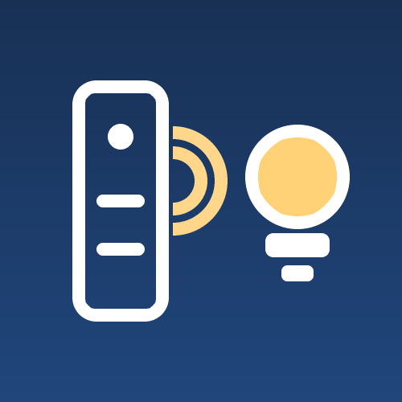
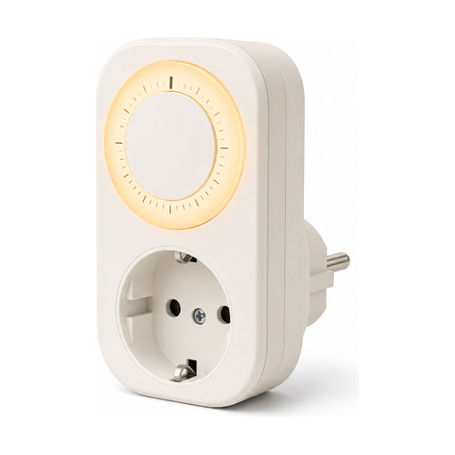
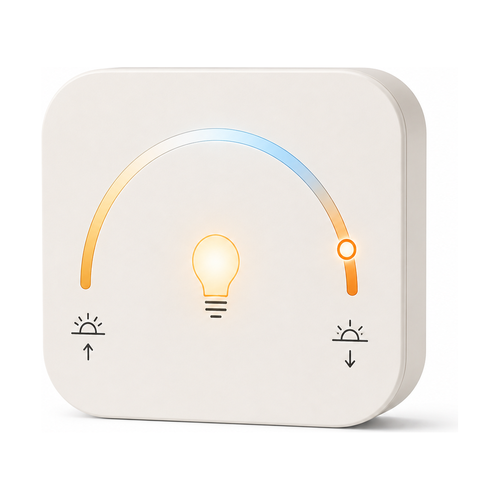
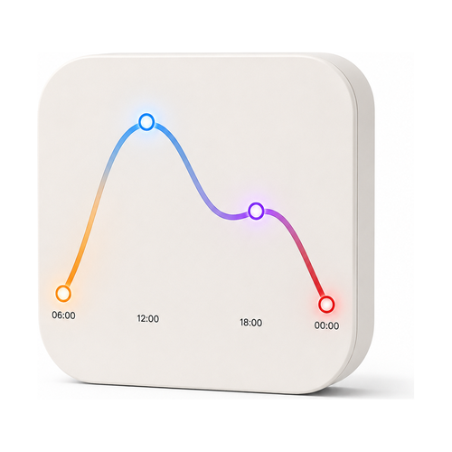

# Lightkeeper

**Use any remote to control any lights, put any lights on a timer, and let them follow the colour
of the day — without writing a single Flow.**

A Homey Pro app. A **Flow** is Homey's automation rule — *when this happens, do that* — and it is
how you normally make a remote drive a lamp. One Flow per button, times every lamp, times every
thing you want that button to do. It works, and it is tedious. Lightkeeper asks you a few questions
instead, then writes those Flows for you and keeps them correct as your home changes. Built end to
end with AI, directed and verified on real hardware by a human — [the full story is
below](#built-with-ai).

## Contents

- [What it does](#what-it-does)
- [Requirements](#requirements)
- [Getting started](#getting-started)
- [What you can rely on](#what-you-can-rely-on)
- [Good to know](#good-to-know)
- [When something is wrong](#when-something-is-wrong)
- [Privacy](#privacy)
- [Changelog](#changelog)
- [Built with AI](#built-with-ai)
- [Contributing](#contributing)
- [Licence](#licence)

---

## What it does

Four kinds of device, doing three jobs: **driving lights from a remote**, **putting lights on a
timer**, and **moving lights through the colours of the day** — that last one in a simple version
and a detailed version. You add them the way you add any Homey device: **Devices → Add →
Lightkeeper**.

<table>
<tr>
<td width="160"></td>
<td>

### Light controller

Turns a remote, switch or dial you have **already paired** with Homey into a controller for lights
you choose. Pick the remote, pick the lights, say what each press, hold or turn should do — on, off,
brighter, dimmer, warmer, cooler.

*Needs a Personal API Key: a token you generate on your own Homey, which is what lets Lightkeeper
write Flows on your behalf. [Step 2 below](#2-give-it-an-api-key--if-you-need-one) walks through
making one.*

</td>
</tr>
<tr>
<td width="160"></td>
<td>

### Light schedule

Puts lights on a timer. You fill in **windows** — one window is one period: the lights come on at a
time you set, and go off again either after a number of minutes or at a second time you set, on the
weekdays you tick. You can also fix the brightness and warmth they come on at, or leave those as
they were. Up to twelve windows in one device, and a switch on the device's tile in Homey that
pauses all of them at once.

*Needs a Personal API Key as well, for the same reason: it writes Flows.*

</td>
</tr>
<tr>
<td width="160"></td>
<td>

### Circadian light

Moves your lights through the colours of the day by itself, and asks only two questions: how your
lights should look at their **warmest** — the low orange light you want in the evening — and at
their **coolest**, the bright white you want at midday. Lightkeeper supplies everything in between:
warm overnight, cooling through the morning, coolest in the middle of the day, warming again from
mid-afternoon.

*No API key, because it writes no Flows. It adjusts lights that are already on, and never switches
one on or off itself.*

</td>
</tr>
<tr>
<td width="160"></td>
<td>

### Curve light

The detailed version of the circadian light above. Same job — colour through the day — but rather
than giving two ends and letting Lightkeeper shape the day, you draw the day yourself, as two to
eight **points**. A point is one moment: a time of day, how warm the light is then, and optionally a
brightness. At any point you may pick **a colour instead of a warmth** — candle, amber, peach, rose,
lavender, ocean, forest or ember, and no others. Between two points the lights fade gradually from
one to the next.

Every point keeps a warmth even when you give it a colour, and a lamp that cannot show colours uses
that warmth — so plain white lamps and colour lamps move through the same day together.

*No API key, and the same rule: it never switches a light on or off.* Choose a Curve light when you
want a particular look at a particular hour; choose a circadian light when "warm at night, cool in
the day" is all you are after.

</td>
</tr>
</table>

All four have a **Test** button while you are setting them up, which drives your actual lights then
and there, so you know it works before you save anything.

The **light controller** and the **light schedule** do their work by writing Homey Flows behind the
scenes, and Lightkeeper looks after those Flows for you. You can point either one at a whole room
instead of at named lamps, and a lamp you add to that room later is picked up on its own. Delete the
device and its Flows are deleted with it — its own, and nothing else. **You never open the Flow
editor.** The **circadian light** and the **Curve light** write no Flows at all: they watch your
lights and adjust them directly, which is why neither needs a key.

---

## Requirements

- **Homey Pro 2023 or later.** Homey Pro 2019 and earlier cannot create API Keys at all, and
  Lightkeeper needs one to write Flows.
- **Firmware 12.9.0 or newer.**
- **Homey Cloud is not supported.** Lightkeeper needs wide access to the local API on the Homey
  itself, which only Homey Pro offers.
- **A Personal API Key**, but only if you are adding a light controller or a light schedule.
  Circadian lights and Curve lights need none. [Why?](FAQ.md#why-does-it-need-a-personal-api-key)

## Getting started

### 1. Install it

From the Homey App Store. Or, if you have cloned this repository, `npx homey app install`.

### 2. Give it an API key — if you need one

Only if you are adding a **light controller** or a **light schedule**. Skip it for a circadian
light or a Curve light: setting one of those up begins straight away with choosing lights.

1. Open [my.homey.app](https://my.homey.app) and pick your Homey
2. Settings → API Keys → New API Key
3. Tick the **Flow** permissions, then create it
4. Copy the key — it is shown only once — and paste it into Lightkeeper when it asks

The key is stored on your Homey and never leaves it. It is never written to a log, never handed
back out by the app, and never included in a diagnostics export. Lightkeeper uses it for one thing
only: **writing Flows**.

A key can stop working — Homey invalidates the session behind it from time to time, even though the
key you pasted is unchanged. If that happens, everything already set up carries on: your controllers
keep driving your lights and your schedules keep firing, because those Flows are already written.
What stops is Lightkeeper's ability to write new Flows or repair existing ones. It asks you for a
fresh key, and nothing you have configured is lost.

### 3. Add your first device

**Devices → Add → Lightkeeper**, then pick a type. Each one is a short sequence of screens:

| Device | The screens |
|---|---|
| Light controller | API key → choose a remote (listed by room, each one showing how many separate presses, holds and turns your Homey can actually see from it) → choose lights → say what each of those should do, with **Test** on every row |
| Light schedule | API key → choose lights → fill in the windows, with **Test on** and **Test off** |
| Circadian light | Choose lights → set the warmest and coolest ends, with **Try it now** |
| Curve light | Choose lights → build the curve point by point, with **Try it now** |

Homey lets you rename a device afterwards, so there is no name field to fill in.

---

## What you can rely on

These are promises, not implementation details — each one is covered by a named test in
[`test/unit/safety-promises.test.ts`](test/unit/safety-promises.test.ts).

- **A ramp stops after 10 seconds, always.** A ramp is what happens while you hold a button down:
  the light keeps getting brighter, or dimmer, until you let go. The trouble is that the "let go"
  message is routinely lost on Zigbee and unreliable on Matter and Thread — so a light that ramps
  until told to stop will eventually never be told, and a lamp stuck ramping is the worst thing this
  app could do to you. Every ramp therefore ends by itself after ten seconds. Not configurable.
- **A Flow you have edited yourself is never overwritten.** If Lightkeeper finds that one of the
  Flows it wrote has been changed by hand, it stops touching it and flags the device as needing
  repair in Homey, so the decision to discard your edit is always yours.
- **Deleting a device deletes only the Flows it demonstrably created.** Attribution is the device's
  own id, carried inside the Flow.
- **A Flow you have moved yourself stays where you put it.** Lightkeeper files the Flows it writes
  into a folder per device, but it will only ever move a Flow that is still sitting in Lightkeeper's
  own folder. Drag one into a folder of your own and it is left alone from then on.
- **Lightkeeper never overrides something you have just done.** Dim or recolour a lamp by hand and
  the Lightkeeper device driving that lamp leaves it alone — just that lamp, not the rest. It takes
  over again the next time the lamp is switched off and on.
- **Nothing leaves your Homey.** No telemetry, opt-in or otherwise.

## Good to know

The five limits most likely to matter. [FAQ.md](FAQ.md#limits) has the rest, stated just as plainly.

- **"Any remote" means any remote your Homey already reports button presses from.** Lightkeeper can
  only work with what the remote's own Homey app publishes — either a change it announces (a button
  state, a dial position) or a Flow trigger card it offers. A few integrations publish neither, and
  then no app on your Homey can react to that remote, Lightkeeper included.
- **Times are clock times** — an hour and a minute you type in. Sunrise and sunset are not available
  yet, neither in schedules nor in circadian and Curve lights.
- **If the app was not running at the moment a window should have ended, that "off" is missed**, and
  those lights stay on until the next window switches them. Lightkeeper deliberately does not go
  back and catch up on a missed "off": having your lights go dark on you some time after a restart
  is the worse surprise.
- **Two Lightkeeper devices pointed at the same lamp will fight over it** — a schedule sets
  brightness and warmth as it switches lights on, while a circadian or Curve light keeps changing
  them all day. Give any one lamp to one Lightkeeper device.
- **A circadian light and a Curve light check in every few minutes**, and write to a lamp only once
  the colour has moved far enough to be visible. Neither does anything while the app is not
  running.

## When something is wrong

Homey settings → Lightkeeper lists the remote presses it received most recently, whether each one
was acted on or ignored **and why**, and every change it actually tried to make to a light. When a
button appears to do nothing, that page separates the three reasons it could be: the Flow never
fired at all, or it fired and the lamp refused the change, or Lightkeeper worked out what to do and
the instruction never got sent. Knowing which of the three you have is what makes a silent failure
diagnosable at all.

**[FAQ.md → When something is wrong](FAQ.md#when-something-is-wrong)** walks through the symptoms
one at a time: a press that does nothing, a remote whose buttons Lightkeeper cannot offer you, a key
that will not validate, a schedule that did not fire, and what Homey's **Repair** does when you run
it on a Lightkeeper device.

## Privacy

Nothing leaves your Homey — no telemetry, no cloud, no analytics. The diagnostics export is
generated locally and shared only if you choose to attach it to a bug report, and it deliberately
contains no key material. [`docs/privacy.md`](docs/privacy.md) is the full notice: what the app
reads, what it stores, and for how long.

---

## Changelog

**0.5.1** — the current release. Nothing about how the app works changed; this is the App Store
listing:

- **A new tagline, and a description a third of its old length.** The old tagline listed the same
  three jobs the description opened with; the description opened with a backstory. The store clamps
  it to ten lines behind a "read more", so the first paragraph has to be the whole pitch.
- **The changelog reads as prose.** The store renders it in a bare paragraph with no line breaks, so
  the Markdown headings and bullets it used to carry came out as one run-on sentence with visible
  asterisks. Every entry is flattened, and a test now fails on any that is not.
- **The four device icons are legible in the store's flow-card circle.** A 960-unit canvas is drawn
  into 24 px there, where a 34-unit stroke is 0.85 px — so each icon lost the frame around its
  subject and everything worth less than a pixel. Two of them say something different as well: the
  circadian icon is a rayed sun on the horizon rather than a bulb under an arch, and the remote
  sends a signal rather than reading as a speaker.
- **`npm run render:icons`** draws every icon at that size using homey.app's own markup and CSS,
  which is the only way to see it before publishing.

Earlier releases, one line each:

| Version | What changed |
|---|---|
| **0.5.0** | A Curve light as a fourth device type, a simpler circadian light, and less memory used |
| **0.4.0** | Circadian lights: follow the colour of the day, and no API key needed for them |
| **0.3.1** | Generated Flows grouped into a folder per device |
| **0.3.0** | New artwork throughout, a new palette, and a README banner |
| **0.2.2** | Line-art icons, and photographs rather than rasterised marks in the store |
| **0.2.1** | Fixed colour temperature running backwards |
| **0.2.0** | Light schedules, as a second kind of device — and the name Lightkeeper |
| **0.1.1** | Repair opens again; a changelog and an enforced release process |
| **0.1.0** | First release: remotes driving lights, with the Flows written for you |

**[CHANGELOG.md](CHANGELOG.md) has every release in full.**

## Built with AI

This app was designed and written end to end with [Claude](https://claude.com/claude-code) —
architecture, implementation, tests and documentation. A human directed the work, made the product
decisions, and verified the result on real hardware.

That is stated plainly because you deserve to know what you are installing and what you are reading.
If it changes how carefully you want to review the code before trusting it with your home: fair, and
the code is right here.

It has been verified end to end on a Homey Pro 2023 across four remotes and three transports, with
Over 900 unit tests covering the logic — [how well tested is this?](FAQ.md#how-well-tested-is-this) has
the detail, including what has *not* run on hardware yet.

## Contributing

**[CONTRIBUTING.md](CONTRIBUTING.md)** is the developer front door — setup, the house rules, and
what has to pass before a PR. [`CLAUDE.md`](CLAUDE.md) has the architecture and conventions, and
[`docs/homey-platform.md`](docs/homey-platform.md) is a thirteen-section reference on how Homey
actually behaves, established against real hardware and documented nowhere else.
[`docs/README.md`](docs/README.md) indexes everything else.

Bug reports are best accompanied by the diagnostics export from Homey settings → Lightkeeper →
**Copy for a bug report**, which deliberately contains no key material.

## Licence

[MIT](LICENSE) © Thomas René Sidor
