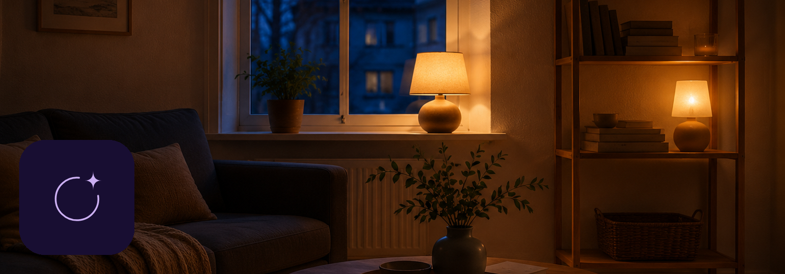
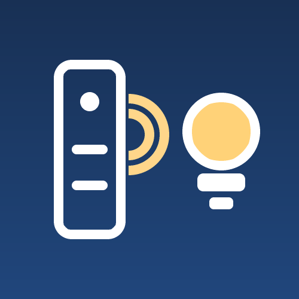
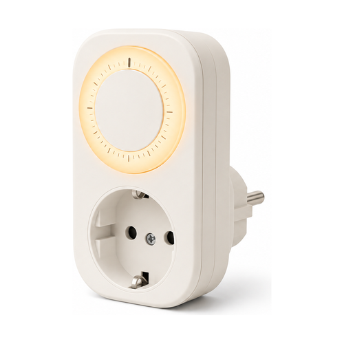
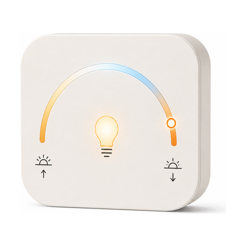
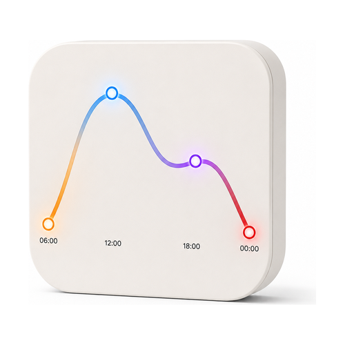
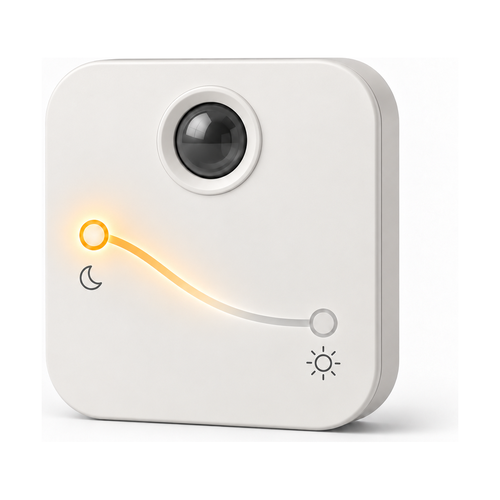

# Lightkeeper

**Control any lights from any remote, put them on a timer, let them follow the colour of the day,
and let them dim as daylight comes up — without writing a single Flow.**

A Homey Pro app. Normally a remote drives a lamp through Flows — one per button, per lamp, per
action. Lightkeeper asks a few questions instead, writes those Flows for you, and keeps them correct
as your home changes.

> [!WARNING]
> **Early access.** Lightkeeper is a 0.x app, and an update can change or break a device you have
> already set up — it may need Homey's **Repair**, or deleting and adding again. Migrations are
> written wherever possible and every change is named in [the changelog](CHANGELOG.md), but there is
> no compatibility promise before 1.0.

## Contents

- [What it does](#what-it-does)
- [Using Lightkeeper in your own Flows](#using-lightkeeper-in-your-own-flows)
- [Requirements](#requirements)
- [Getting started](#getting-started)
- [What you can rely on](#what-you-can-rely-on)
- [Good to know](#good-to-know)
- [When something is wrong](#when-something-is-wrong)
- [Privacy](#privacy)
- [Changelog](#changelog)
- [Built with AI](#built-with-ai)
- [Contributing](#contributing)

---

## What it does

Five device types. Add them like any Homey device: **Devices → Add → Lightkeeper**.

<table>
<tr>
<td width="160"></td>
<td>

### Light Remote

Turns a remote, switch or dial you have **already paired** into a controller for the lights you
choose. Say what each press, hold or turn does — on, off, brighter, dimmer, warmer, cooler, a set
brightness or a colour — for all the lights or just some. A button can also turn lights on with the
colour and brightness your other Lightkeeper devices want right now.

*Needs a [Personal API Key](#2-an-api-key-if-you-need-one), because it writes Flows.*

</td>
</tr>
<tr>
<td width="160"></td>
<td>

### Light schedule

Puts lights on a timer. Each **block** switches them on at a time, and off after a number of minutes
or at a second time, on the weekdays you tick — optionally with a colour and brightness. Up to twelve
blocks, and one switch on the tile pauses them all.

*Needs a Personal API Key too.*

</td>
</tr>
<tr>
<td width="160"></td>
<td>

### Circadian light

Moves lights through the colours of the day. Set how warm **morning**, **midday** and **evening**
should be; the boundaries follow your own sunrise and sunset through the year. Brightness is
optional.

</td>
</tr>
<tr>
<td width="160"></td>
<td>

### Colour Curve Light

The detailed version: draw the day yourself as two to eight **points**, each a time, a warmth or one
of 34 colours, and optionally a brightness. White-only lamps use the warmth, so every lamp follows
the same day.

</td>
</tr>
<tr>
<td width="160"></td>
<td>

### Room-sensing Light

Sets brightness from how light the room already is — from **a light sensor you own** or from **how
high the sun is**. You choose the brightness for a dark room and for a bright one; setup shows the
sensor's last week so you can pick sensible thresholds.

</td>
</tr>
</table>

Every setup has a **Test** button that drives your real lights before you save.

The Light Remote and the light schedule work through Flows that Lightkeeper writes and maintains;
point one at a room and lamps added later are picked up. Deleting the device deletes its Flows and
nothing else. The other three write no Flows and need no key: they adjust lights directly, and never
switch one on or off. In each one's Settings you choose how it controls your lights — after they
turn on, before they turn on (not on a Room-sensing Light), or not at all — and its **Transition**:
*Gradual*, *Balanced* or *Quick*.

## Using Lightkeeper in your own Flows

Optional. If you build Flows yourself:

- **Tags.** Every device shows what it wants the lights to be — brightness, colour temperature,
  colour, how light it is outside — and each value is a Flow tag and an Insights graph.
- **Set lights the Lightkeeper way.** One card, one write: colour from one Lightkeeper device,
  brightness from another. It switches lights on only if you ask it to.
- **It is dark enough.** A condition that asks a Room-sensing Light, so you keep one threshold, not
  two. When it cannot tell, the answer is no.

## Requirements

- **Homey Pro 2023 or later**, firmware 12.9.0 or newer. Not Homey Cloud.
- **A Personal API Key** — only for a Light Remote or a light schedule.
  [Why?](FAQ.md#why-does-it-need-a-personal-api-key)
- **Your Homey's location**, for sunrise, sunset and the sun's height. Without it a circadian light
  uses 06:00 and 21:00.
- Works in all thirteen languages Homey supports. Logs and generated Flow names stay in English.

## Getting started

### 1. Install it

From the Homey App Store, or `npx homey app install` from a clone of this repository.

### 2. An API key, if you need one

Only for a Light Remote or a light schedule, and only once per Homey. Setup asks for it first.

1. Open [my.homey.app](https://my.homey.app) and pick your Homey
2. Settings → API Keys → New API Key
3. Tick the **Flow** permissions and create it
4. Copy the key (shown once) and paste it into Lightkeeper

The key stays on your Homey and is never logged or exported. If Homey later invalidates it, your
existing Flows keep working; Lightkeeper just asks for a fresh key before it can write new ones.

### 3. Add a device

**Devices → Add → Lightkeeper**, pick a type, and answer one question per screen. The last screen
reviews everything before saving.

| Device | Steps |
|---|---|
| Light Remote | API key → remote → lights → buttons → review |
| Light schedule | API key → lights → blocks → review |
| Circadian light | lights → morning, midday, evening → review |
| Colour Curve Light | lights → curve → review |
| Room-sensing Light | lights → sensor or sun → dark and bright → review |

## What you can rely on

Each is covered by a test in [`test/unit/safety-promises.test.ts`](test/unit/safety-promises.test.ts).

- **A ramp stops after 10 seconds, always.** "Button released" messages get lost on Zigbee, Matter
  and Thread, so a held-button ramp ends by itself.
- **A Flow you have edited is never overwritten.** The device is flagged for Repair instead.
- **Deleting a device deletes only the Flows it created.**
- **A Flow you have moved stays where you put it.**
- **Lightkeeper never overrides what you just did.** Change a lamp by hand and it is left alone until
  it is switched off and on, or for four hours.
- **Nothing leaves your Homey.** No telemetry.

## Good to know

[FAQ.md](FAQ.md#limits) has the full list.

- **"Any remote" means any remote Homey already reports presses from.** If its app publishes neither
  a state change nor a Flow trigger, no app can use it.
- **Schedule blocks and curve points are clock times.** Only the circadian light follows the sun.
- **A missed "off" is not caught up.** If the app was not running when a block ended, the lights stay
  on until the next block.
- **Give each lamp to one Lightkeeper device.** Two devices on one lamp will fight over it.

## When something is wrong

Homey settings → Lightkeeper lists recent presses, whether each was acted on and why, and every
change sent to a light — enough to tell a Flow that never fired from a lamp that refused. The
[FAQ](FAQ.md#when-something-is-wrong) walks through the common symptoms.

## Privacy

No telemetry, no cloud, no analytics. The diagnostics export is made locally, contains no key, and
is shared only if you choose. [`docs/privacy.md`](docs/privacy.md) has the full notice.

---

## Changelog

**0.6.6**

- **Control and Transition in the device's Settings** — no need to open Repair.
- **Transition: Gradual, Balanced or Quick** on circadian, Colour Curve and Room-sensing Lights.
  Circadian lights now blend between parts of the day; existing ones are set to *Quick*.
- **Every language Homey speaks**, and icons on every value a device shows.

| Version | What changed |
|---|---|
| **0.6.5** | Choose how a device controls your lights, a remote button that follows your other devices, Lightkeeper's values in your own Flows |

**[CHANGELOG.md](CHANGELOG.md) has every release.**

## Built with AI

Designed and written end to end with [Claude](https://claude.com/claude-code); a human directed the
work, made the product decisions and verified it on real hardware — a Homey Pro 2023, four remotes,
three transports, and over 2000 unit tests. [How well tested is this?](FAQ.md#how-well-tested-is-this)

## Contributing

Start with **[CONTRIBUTING.md](CONTRIBUTING.md)**. [`CLAUDE.md`](CLAUDE.md) has the architecture,
[`docs/homey-platform.md`](docs/homey-platform.md) how Homey really behaves, and
[`docs/README.md`](docs/README.md) the rest. Attach the diagnostics export (Homey settings →
Lightkeeper → **Copy for a bug report**) to bug reports.

[MIT](LICENSE) © Thomas René Sidor
